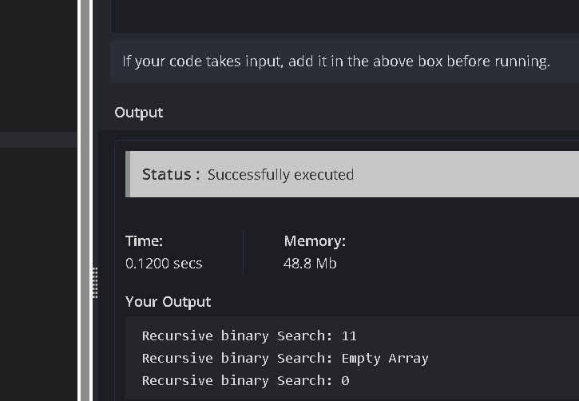
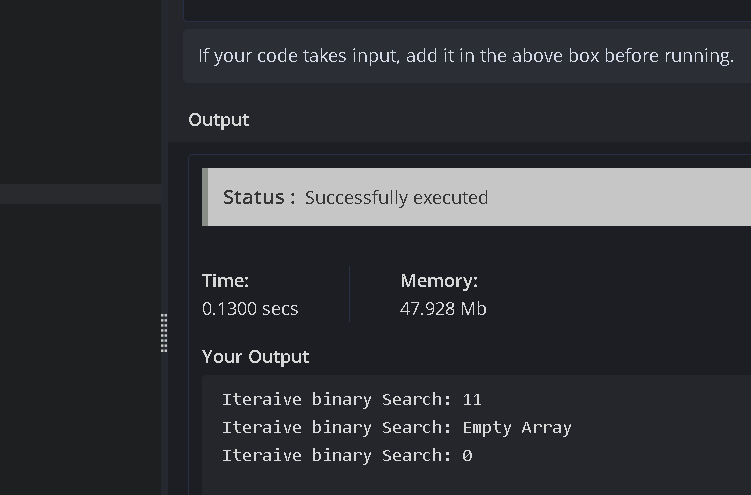

## 🔍 Binary Search (Recursive vs Iterative)


This project demonstrates the **Binary Search** algorithm implemented in two different ways:

- **Recursive Binary Search**
- **Iterative Binary Search**

The goal is to compare:

- **Execution time**
- **Space complexity**
- **Code structure**


---

## 📂 Project Structure

```
binarySearch/
│── binarySearchUsingRecursiveMethod.js   # Recursive implementation
│── binarySearchUsingIterativeMethod.js   # Iterative implementation
│── README.md                             # Documentation
│── images/                               # Diagrams, screenshots, etc.
│ ├── RecursiveImg.png
│ └── IterativeImg.png

````

---

## ⚡ How to Run


Make sure you have [Node.js](https://nodejs.org/) installed.

bash
# Clone this repo
git clone https://github.com/AwaizSayed/mergeSort.git

# Move into project folder
cd mergeSort   # (or binarySearch if renamed)

# Run Recursive version
node binarySearchUsingRecursiveMethod.js

# Run Iterative version
node binarySearchUsingIterativeMethod.js


---

## 📝 Example Output

```
Recursive Binary Search:
Searching for 8 in [2, 3, 4, 5, 8]
Found at index: 4

Iterative Binary Search:
Searching for 8 in [2, 3, 4, 5, 8]
Found at index: 4
```

---

## 📊 Comparison (Recursive vs Iterative)

| Method    | Time Complexity | Space Complexity | Notes                                |
| --------- | --------------- | ---------------- | ------------------------------------ |
| Recursive | O(log n)        | O(log n)         | Uses system call stack for recursion |
| Iterative | O(log n)        | O(1) extra space | More memory efficient                |

---

## 🖼️ Screenshots

### Recursive Binary Search



### Iterative Binary Search



---

## 🚀 Future Improvements

- Add performance benchmarks on very large datasets
- Handle cases with duplicate elements
- Add visualization of search steps

---

## 👨‍💻 Author

**Awaiz Sayed**
📧 [sawaiz2004@gmail.com](mailto:sawaiz2004@gmail.com) 🔗 [GitHub Profile](https://github.com/AwaizSayed)
